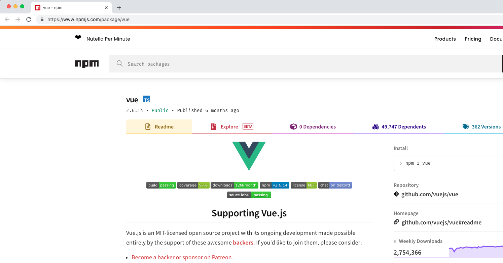
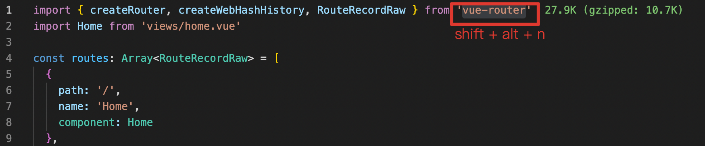

# Can I Search

You Can Search.

## Features
Press `shift + alt + s` to open the input box to search.

Search in the browser by default, in addition, there are four keywords (`web npm gh tr`) to provide search.

Enter keywords in the input box, after the space, add the content you want to search.




Quickly open the browser to search after selecting keywords.

* web: `shift + alt + w`

* npm: `shift + alt + n`

* github: `shift + alt + g`

* translate: `shift + alt + t`




## Extension Settings
You can configure different parameters in setting.json, or customize some parameters.

for example
```
"can-i-search":{
    "web":"https://www.google.com/search?q={query}",
    "jue": "https://juejin.cn/search?query={query}"
}
```